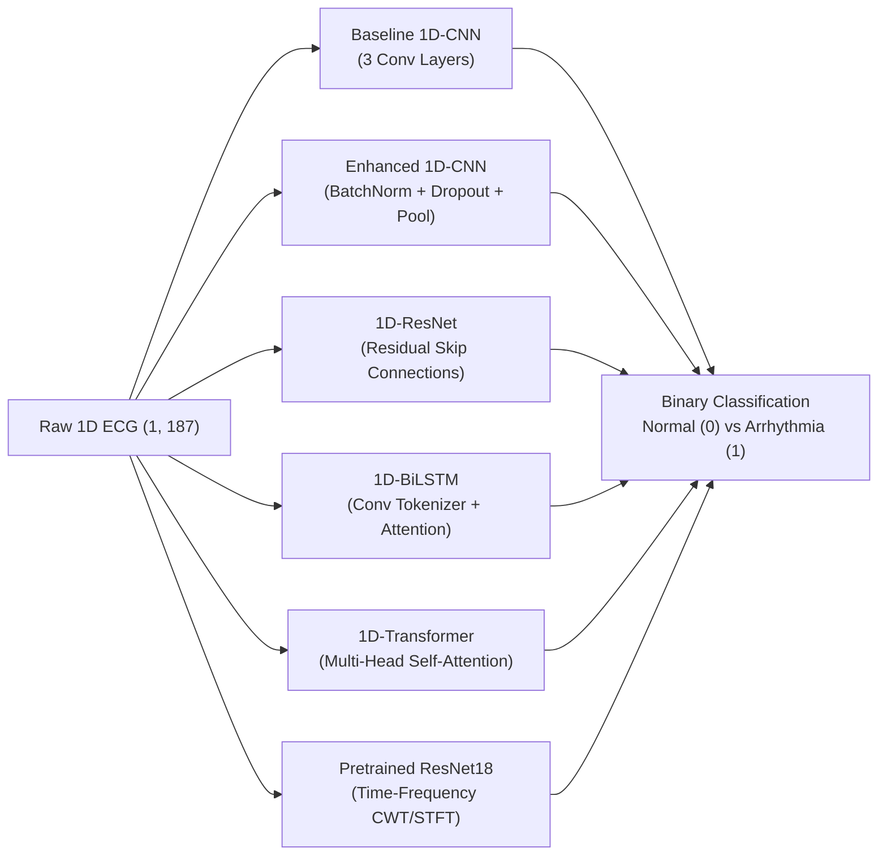
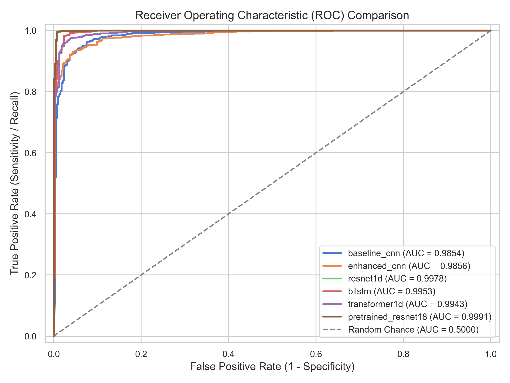
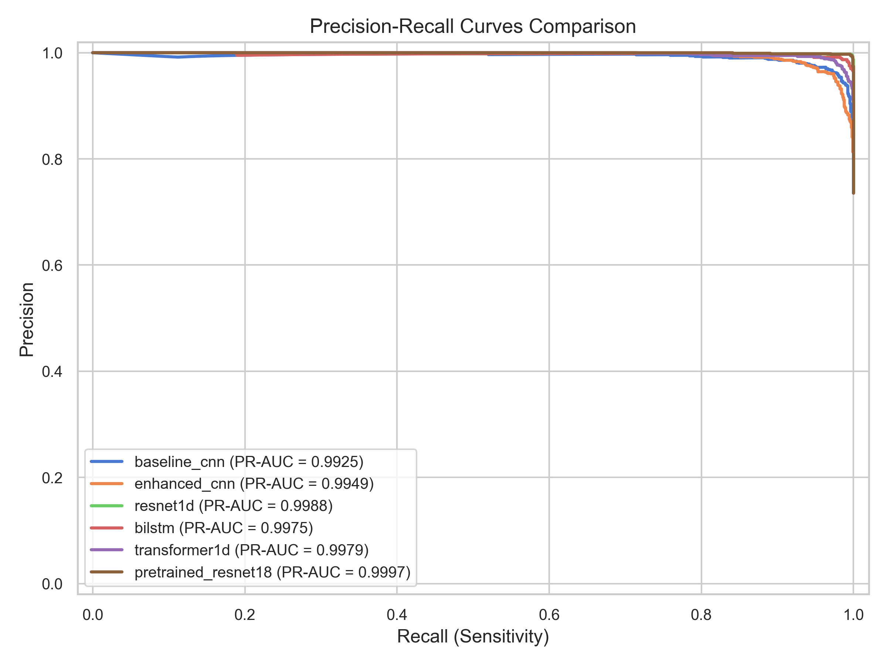
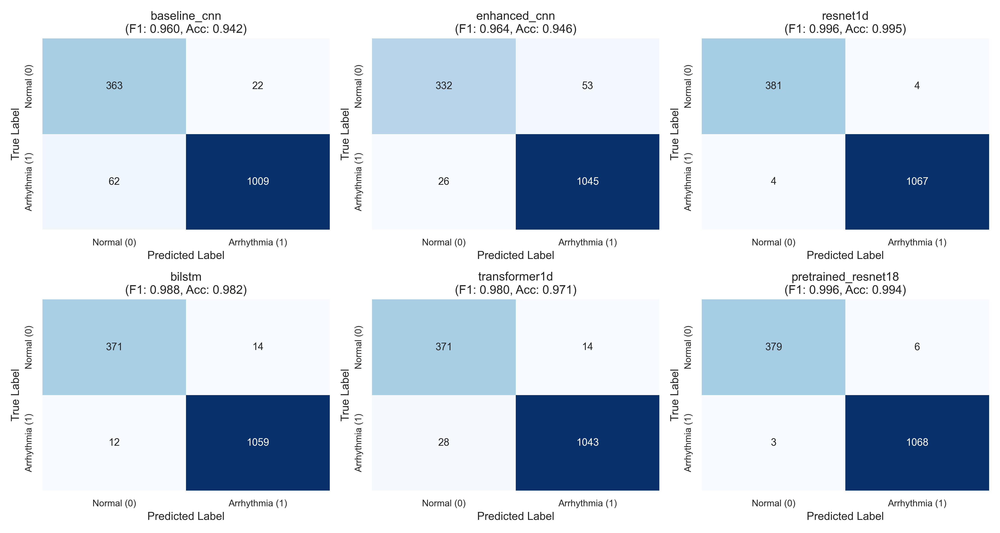
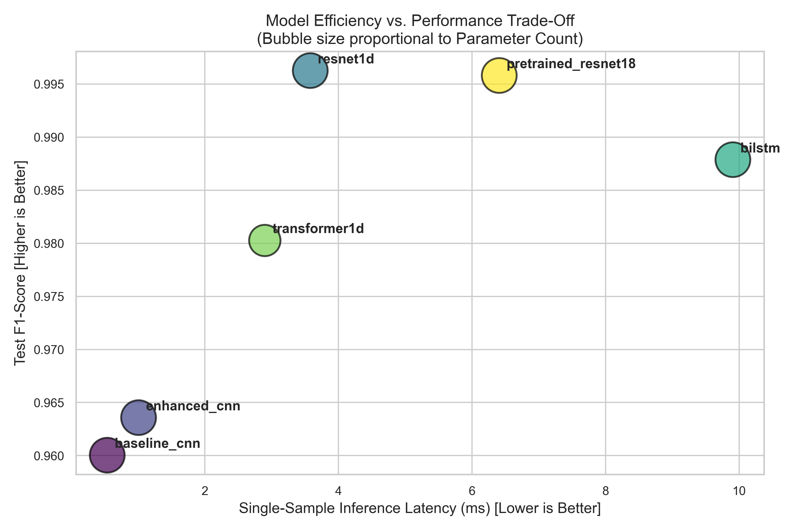

# 🫀 ECG Arrhythmia Detection & Deep Learning Benchmarking Framework

[](https://www.python.org/)
[](https://pytorch.org/)
[](LICENSE)

An end-to-end, modular, reproducible deep learning benchmarking framework for **automated cardiac arrhythmia detection** from single-channel 1D electrocardiogram (ECG) heart signals.

The framework systematically trains, evaluates, and compares multiple state-of-the-art neural architectures across **clinical diagnostic performance** (Sensitivity, Specificity, F1-Score, ROC-AUC, PR-AUC) and **computational efficiency** (Inference Latency, Throughput, Model Size, FLOPs).

---

## 📌 Problem Overview & Clinical Motivation

Arrhythmia refers to any disturbance in the rate, regularity, or site of origin of cardiac electrical impulses. Early and accurate detection of abnormal heartbeats is critical for preventing life-threatening events such as ventricular fibrillation, stroke, or heart failure.

* **Class 0 (Normal Sinus Rhythm)**: Typical P-QRS-T morphological pattern.
* **Class 1 (Arrhythmia)**: Ectopic or abnormal beats with irregular morphology or premature timing.

```
       R (Peak)
       /\
      /  \
 P   /    \    T
/\  /      \  /\
  \/        \/
  Q          S
  <-- 187 Sampling Points -->
```

---

## 📊 Dataset Characteristics

The project evaluates single-beat ECG time series sampled at 187 discrete temporal points:

| Split | Number of ECG Beats | Features / Beat | Class Distribution (0 : 1) |
| :--- | :--- | :--- | :--- |
| **Train** | 11,641 | 187 | 3,265 Normal (28.0%) : 8,376 Arrhythmia (72.0%) |
| **Validation** | 1,455 | 187 | 396 Normal (27.2%) : 1,059 Arrhythmia (72.8%) |
| **Test** | 1,456 | 187 | 385 Normal (26.4%) : 1,071 Arrhythmia (73.6%) |
| **Total** | **14,552** | **187** | **4,046 Normal : 10,506 Arrhythmia** |

> [!NOTE]
> All data loaders maintain strict chronological feature indexing (`0` through `186`) to preserve temporal sequence integrity.

---

## 🧠 Model Zoo & Architectures

The framework benchmarks 6 diverse neural network paradigms:



1. **Baseline 1D-CNN (`baseline_cnn`)**: The original 3-stage 1D convolutional baseline model.
2. **Enhanced 1D-CNN (`enhanced_cnn`)**: Modern 4-stage 1D-CNN with `BatchNorm1d`, `Dropout(0.25)`, and Global Average Pooling.
3. **1D-ResNet (`resnet1d` / `resnet18_1d`)**: Deep 1D Residual Network with skip connections to eliminate gradient degradation across temporal layers.
4. **1D-BiLSTM (`bilstm`)**: Bidirectional Long Short-Term Memory network equipped with a convolutional tokenizer and learned Attention Pooling.
5. **1D-Transformer (`transformer1d`)**: Temporal Transformer with learnable positional encodings and multi-head self-attention.
6. **Pretrained Transfer Model (`pretrained_resnet18`)**: Converts 1D ECG into 2D Continuous Wavelet / Spectrogram time-frequency scalograms, processed by an ImageNet-pretrained vision backbone.

---

## 🏆 Benchmark Leaderboard & Results

*Evaluated on **1,456 unseen test ECG beats** (sorted by Test F1-Score):*

| Model | Accuracy (%) | Sensitivity / Recall (%) | Specificity (%) | Precision (%) | F1-Score | ROC-AUC | PR-AUC | Test Loss | Params (K) | Latency (ms) | Throughput (sps) | Size (MB) |
| :--- | :---: | :---: | :---: | :---: | :---: | :---: | :---: | :---: | :---: | :---: | :---: | :---: |
| **`resnet1d`** | **99.45%** | **99.63%** | **98.96%** | **99.63%** | **0.9963** | **0.9978** | **0.9988** | **0.0235** | 1,574.0 | 3.58 | 5,669.9 | 6.00 |
| **`pretrained_resnet18`** | **99.38%** | **99.72%** | **98.44%** | **99.44%** | **0.9958** | **0.9991** | **0.9997** | **0.0232** | 11,177.0 | 6.41 | 962.1 | 42.64 |
| **`bilstm`** | **98.21%** | **98.88%** | **96.36%** | **98.70%** | **0.9879** | **0.9953** | **0.9975** | **0.0579** | 189.1 | 9.91 | 5,194.4 | 0.72 |
| **`transformer1d`** | **97.12%** | **97.39%** | **96.36%** | **98.68%** | **0.9803** | **0.9943** | **0.9979** | **0.0831** | 105.2 | 2.90 | 4,000.8 | 0.40 |
| **`enhanced_cnn`** | **94.57%** | **97.57%** | **86.23%** | **95.17%** | **0.9636** | **0.9856** | **0.9949** | **0.1672** | 167.6 | 1.01 | 14,855.9 | 0.64 |
| **`baseline_cnn`** | **94.23%** | **94.21%** | **94.29%** | **97.87%** | **0.9600** | **0.9854** | **0.9925** | **0.1589** | 203.2 | 0.54 | 25,729.7 | 0.78 |

### Key Clinical & Efficiency Insights:
- **Top Clinical Performer (`resnet1d`)**: Achieved **99.45% accuracy**, **99.63% sensitivity**, and an **F1-score of 0.9963** with only 3.58 ms latency.
- **Highest Sensitivity (`pretrained_resnet18`)**: Achieved the highest Arrhythmia detection rate (**99.72% Sensitivity / 0.9991 ROC-AUC**), vital in clinical screening to minimize false negatives.
- **Highest Throughput (`baseline_cnn` & `enhanced_cnn`)**: The 1D CNNs processed over **14,000 to 25,000 ECG beats/second** with sub-millisecond latencies, making them ideal for ultra-low-power embedded wearable monitors.

---

## 📈 Benchmark Visualizations

All visual artifacts are automatically generated in `results/plots/`:

| ROC Curves | Precision-Recall Curves |
| :---: | :---: |
|  |  |

| Confusion Matrices (Grid) | Efficiency vs. Performance Trade-Off |
| :---: | :---: |
|  |  |

---

## 🚀 Quickstart & Usage

### 1. Installation

```bash
git clone https://github.com/TewodrosAdimas/arrhythmiaDetection.git
cd arrhythmiaDetection
pip install -r requirements.txt
```

### 2. Verify Dataset

```bash
python data/prepare_data.py --data-dir data
```

### 3. Train a Model

```bash
# Train 1D-ResNet
python train.py --model resnet1d --epochs 25 --batch-size 64 --lr 0.001 --augment

# Train 1D-BiLSTM
python train.py --model bilstm --epochs 20 --batch-size 64

# Train 1D-Transformer
python train.py --model transformer1d --epochs 20 --batch-size 64
```

### 4. Evaluate a Trained Checkpoint

```bash
python evaluate.py --model resnet1d --checkpoint results/checkpoints/resnet1d_best.pth
```

### 5. Run the Full Multi-Model Benchmark Suite

```bash
python benchmark.py --epochs 15 --batch-size 128
```

### 6. Interactive Visual Analysis Notebook

Launch the analysis notebook:

```bash
jupyter notebook notebooks/benchmark_analysis.ipynb
```

---

## 📂 Project Structure

```
arrhythmiaDetection/
├── README.md                           # Project documentation & benchmark leaderboard
├── requirements.txt                    # Python dependencies
├── .gitignore                          # Clean git hygiene
├── train.py                            # CLI to train individual models
├── evaluate.py                         # CLI to evaluate checkpoints
├── benchmark.py                        # Automated multi-model benchmark pipeline
│
├── data/                               # Dataset directory
│   ├── prepare_data.py                 # Dataset verification script
│   ├── train.csv                       # Training split (11,641 samples)
│   ├── val.csv                         # Validation split (1,455 samples)
│   └── test.csv                        # Test split (1,456 samples)
│
├── src/                                # Core library
│   ├── data/
│   │   ├── dataset.py                  # High-performance tensor ECG Dataset & DataLoaders
│   │   └── transforms.py               # 1D augmentations & CWT scalograms
│   ├── models/
│   │   ├── factory.py                  # Model registry (build_model, list_models)
│   │   ├── baseline_cnn.py             # Baseline 3-layer 1D CNN
│   │   ├── enhanced_cnn.py             # Modern 1D CNN (BatchNorm + Dropout + Pooling)
│   │   ├── resnet1d.py                 # 1D-ResNet (Residual skip connections)
│   │   ├── rnn1d.py                    # 1D-BiLSTM with Attention Pooling
│   │   ├── transformer1d.py            # 1D Temporal Transformer
│   │   └── pretrained_cwt.py           # Pretrained ResNet18 via CWT
│   ├── engine/
│   │   ├── trainer.py                  # PyTorch Trainer (Early Stopping, Schedulers)
│   │   └── evaluator.py                # Standalone test evaluator
│   └── utils/
│       ├── metrics.py                  # Clinical classification metrics
│       ├── profiler.py                 # Latency, Throughput, Parameters, FLOPs
│       ├── logger.py                   # Real-time console and file logger
│       └── visualization.py            # ROC, PR, Confusion Matrix, Trade-off plots
│
├── notebooks/
│   └── benchmark_analysis.ipynb        # Interactive analysis notebook
└── results/                            # Benchmark artifacts & outputs
    ├── benchmark_summary.md            # Markdown leaderboard table
    ├── benchmark_summary.csv           # CSV metrics export
    ├── benchmark_summary.json          # Full evaluation JSON
    └── plots/                          # PNG visual charts
```

---

## 👨‍💻 Author & Attribution

**Tewodros Bewuket**  
*MSc Artificial Intelligence — Università degli Studi di Milano-Bicocca*